# Technical Report: AI-Driven Automated Land Use / Land Cover Mapping System for Andhra Pradesh

**Project:** PS-6 Intelligent Cartography Pipeline — V6 Pro
**Application:** Automated Building Detection, Road Network Extraction & Auto-Completion, Water Body Delineation & Temporal Change Detection
**Region:** Andhra Pradesh, India
**Organization:** Yantrikaran Innovation Pvt. Ltd
**Date:** March 2026 (updated June 2026)
**Model:** SegFormer-B5 — 84M Parameters
**Best mIoU:** 0.5474

**Live Web App:** <https://smart-property-identification-urban.vercel.app>

---

## 1. Executive Summary

This report presents a production-grade, end-to-end deep learning pipeline for automated semantic segmentation of high-resolution satellite imagery, purpose-built for Andhra Pradesh's PS-6 land mapping requirements. The system combines a state-of-the-art 84-million parameter **SegFormer-B5** transformer with domain-specific geometric post-processing — including **skeleton-based road network auto-completion** — and a cloud-native deployment architecture to produce survey-grade land use / land cover (LULC) maps at scale, with automated monthly, quarterly, and annual temporal change monitoring.

> **Deployment note (June 2026):** The live prototype currently runs on a lightweight, cost-free cloud stack — **Hugging Face Spaces** (model inference + data API), **Vercel** (web app), and **Cloudflare R2** (object storage). The **AWS SageMaker + ArcGIS Online** architecture (see *Deployment Architecture* and *ArcGIS Integration*) is the **target production architecture**. Both are documented below.

**Final Model Performance (60 Epochs, T4×2 GPU, ~48 hours):**

| Metric | Value |
|---|---|
| Overall mIoU | 0.5474 |
| Background IoU | 0.880 |
| Building IoU | 0.430 |
| Road IoU | 0.431 |
| Water IoU | 0.635 |
| Open Land IoU | 0.281 |
| TTA + V4 Post-processed mIoU | 0.5474 |

**Key Innovations**

1. **SegFormer-B5 Encoder** — the largest SegFormer variant (~84M parameters) pretrained on ADE20K-640, providing superior multi-scale feature extraction over B4.
2. **Focal Tversky + Weighted CE Training** — recall-oriented loss with asymmetric FN/FP weighting (α=0.3, β=0.7), focal hard-example mining (γ=0.75), and auto-computed class weights with 2× road boosting.
3. **4-Way TTA + Geometry-Constrained Post-Processing** — test-time flip averaging, convex-hull building regularization, and **skeleton-based road width normalization with gap bridging (road auto-completion)**.
4. **Cloud Inference Pipeline** — current prototype on Hugging Face Spaces (CPU) with Cloudflare R2 large-file handling; target production on AWS SageMaker scheduled endpoints.
5. **Interactive Web Platform** — live LULC mapping, AOI-based analytics, upload-and-analyze, and temporal change detection, with an in-app **Auto-Guide tour mode**.

---

## 2. Results & Demo

**Live Web App:** <https://smart-property-identification-urban.vercel.app>
**Demo Video:** _[paste demo video link here]_

### 2.1 Quantitative Results (Validation — 2,736 chips)

| Class | IoU |
|---|---|
| Background | 0.880 |
| Building | 0.430 |
| Road | 0.431 |
| Water | 0.635 |
| Open Land | 0.281 |
| **Overall mIoU (TTA + V4)** | **0.5474** |

### 2.2 Prediction Gallery

> _Insert result screenshots below — one sample per row (RGB / Ground Truth / Raw Prediction / V4 + TTA / Confidence)._

| # | Sample | Result Screenshot |
|---|---|---|
| 1 | RGB → Prediction (V4 + TTA) | _[insert result image]_ |
| 2 | RGB → Prediction (V4 + TTA) | _[insert result image]_ |
| 3 | RGB → Ground Truth → Prediction | _[insert result image]_ |
| 4 | Confidence map sample | _[insert result image]_ |
| 5 | Change detection (before / after / change) | _[insert result image]_ |

---

## 3. Platform Navigation Guide

The web app exposes five primary sections via the top navigation bar.

| Nav Item | What it does |
|---|---|
| **Home** | Landing overview of the platform, status, and quick links. |
| **Mapping** | Interactive Mapbox map of AP districts. Toggle LULC, drone imagery, buildings/roads/water/open layers; switch base maps; draw or upload an **Area of Interest (AOI)**; view **AOI analytics** (building/water counts, road km); and view **detection overlays** sent from Upload & Analysis. |
| **Upload & Analysis** | Run AI on your own imagery: **AI Segmentation**, **Change Detection** (two images), **Boundary Analysis**, and **Mask Overlay**. Supports up to **500 MB** images via temporary cloud storage. |
| **Data Logs** | Processing history and dataset/run records. |
| **DSS** | Decision-Support dashboards and analytics. |

### 3.1 Quick Workflows

- **Analyze an AOI:** Mapping → pick State/District → *Draw AOI* or *Upload* a boundary (GeoJSON/Shapefile/KML/GeoPackage) → the map auto-detects the district, clips data to the boundary, and shows counts of buildings, water bodies, and road length. Multi-polygon files let you click any parcel to see its individual stats.
- **Segment an image:** Upload & Analysis → *AI Segmentation* → drop one or more images → run → view input vs. colored mask + class-distribution stats → download.
- **Plot a GeoTIFF on the map:** after segmenting a GeoTIFF, click **"Plot Detection Overlay on Map"** → it is placed as a geo-referenced overlay on the Mapping page with opacity / zoom-to / remove controls.
- **Detect change:** Upload & Analysis → *Change Detection* → upload a PAST and a PRESENT image → run → view past mask, present mask, change map + per-category change percentages.

### 3.2 Auto-Guide Mode

The platform includes an in-app **Auto-Guide tour** that automatically walks new users through every feature — highlighting each control, explaining what it does, and demonstrating a sample workflow. Launch it from the help/guide control; it narrates and visually points to the navigation, AOI tools, layer toggles, analytics panel, and the Upload & Analysis options, so first-time stakeholders can self-onboard without training.

---

## 4. Output Deliverables

| Deliverable | Format | Description |
|---|---|---|
| LULC Classification Map | GeoTIFF / PNG | Per-pixel class labels (5 classes) |
| Building Confidence Map | GeoTIFF | 3-tier confidence raster |
| Change Detection Map | GeoTIFF + SHP + GeoJSON / PNG | Temporal transition polygons + stats |
| Training Metrics | JSON | Per-epoch loss, mIoU, per-class IoU, LR |
| Prediction Gallery | PNG | RGB / GT / Raw / V4+TTA / Confidence |
| Model Weights | PyTorch (.pth) | Model (+ optimizer state) |
| Web Dashboard | Web App | Interactive maps + analytics |
| Change Reports | PDF + Excel | Monthly/quarterly/annual summaries |

---

## 5. Platform Screenshots

> _Screenshots to be inserted by the team (one per row). Replace each placeholder with the corresponding capture._

| # | View | Screenshot |
|---|---|---|
| 1 | Home / landing | _[insert screenshot]_ |
| 2 | Mapping — LULC + layers | _[insert screenshot]_ |
| 3 | Mapping — AOI draw + analytics popup | _[insert screenshot]_ |
| 4 | Upload & Analysis — segmentation result | _[insert screenshot]_ |
| 5 | Upload & Analysis — change detection | _[insert screenshot]_ |
| 6 | Detection overlay on map | _[insert screenshot]_ |
| 7 | Auto-Guide tour in action | _[insert screenshot]_ |

---
---

# Technical Details

## 6. Problem Statement

Manual land use mapping across Andhra Pradesh's 160,000+ km² area is slow, costly, and inconsistent — it relies on manual digitization by GIS analysts and requires 6–12 months per district update, making maps outdated, especially in fast-growing regions like Vijayawada and Visakhapatnam.

The PS-6 mapping standard requires an automated, scalable solution capable of pixel-level classification of **buildings, roads, water bodies, and open land**. The system must maintain high geometric fidelity for building footprints and ensure **complete, continuous road networks without fragmentation**. It should efficiently process thousands of satellite chips per district, support change detection on monthly/quarterly/annual timelines, and deliver results in real time through a web dashboard.

### 6.1 Our Solution

A fully automated AI pipeline that reduces the mapping cycle from months to hours — deployed to the cloud for scheduled periodic re-processing and surfaced through Yantrikaran's custom web application for real-time stakeholder access.

---

## 7. System Architecture — End-to-End Pipeline

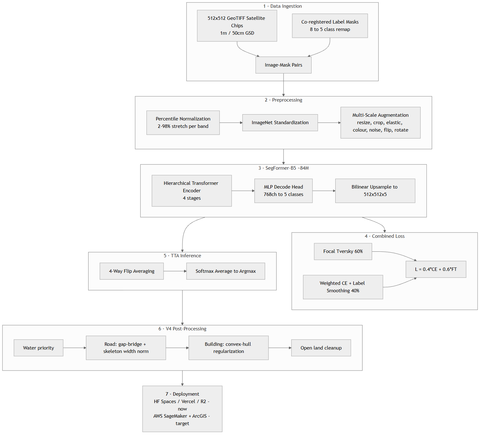{width=6in}


---

## 8. Dataset Architecture — Custom Prepared & Cleaned

### 8.1 Data Sources

| Component | Specification |
|---|---|
| Satellite Imagery | ESRI World Imagery (R&D); Commercial 1m/50cm GSD for production |
| Chip Size | 512 × 512 pixels (512m × 512m at 1m GSD) |
| Geographic Scope | 5 districts across Andhra Pradesh |
| Total Volume | **18,240 chips** (custom prepared) |

> **Note:** ESRI World Imagery is used for R&D under academic/startup licensing. Production deployment will transition to commercial satellite imagery providers at 1m or 50cm GSD via API subscription.

### 8.2 Custom Dataset Preparation Pipeline

The training dataset was **custom-built from scratch** for the AP PS-6 use case — no pre-existing public segmentation dataset covers AP's terrain, building styles, and road patterns at the required resolution. Label masks were constructed from raw **OpenStreetMap (OSM)** vector data (southern India) and **Google Open Buildings** footprints, processed and rasterized using a QGIS + Python geospatial pipeline.

| Property | Detail |
|---|---|
| Custom-built | Entire dataset prepared specifically for AP PS-6 — no public dataset available |
| Source Data | Raw OSM vectors (southern India) + Google Open Buildings footprints |
| Toolchain | QGIS for vector merging, CRS reprojection, class definition, rasterization to GeoTIFF masks |
| CRS-verified | Every image-mask pair verified for spatial alignment and CRS consistency |
| Cleaned | Corrupt/truncated GeoTIFFs filtered; unreadable tiles auto-skipped during training |

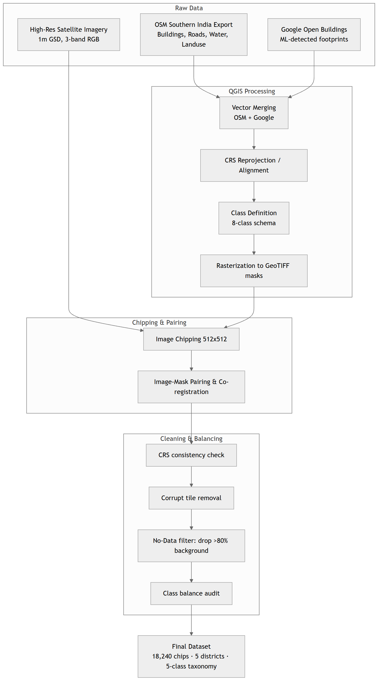{width=6in}


### 8.3 District-wise Data Distribution

| District | Chips | Coverage | Terrain Diversity | Monthly Urban? |
|---|---|---|---|---|
| Anantapur | 4,027 | ~1,055 km² | Semi-arid plateau, sparse settlement | No |
| Guntur | 4,145 | ~1,086 km² | Agricultural delta, canal networks | No |
| Nellore | 5,020 | ~1,315 km² | Coastal plains, aquaculture ponds | No |
| Vijayawada | 2,977 | ~780 km² | Dense urban core, Krishna delta | **Yes** |
| Visakhapatnam | 2,071 | ~543 km² | Coastal urban, port, hills | **Yes** |
| **Total** | **18,240** | **~4,779 km²** | Full AP diversity | |

### 8.4 Class Taxonomy — 8 → 5 Remapping

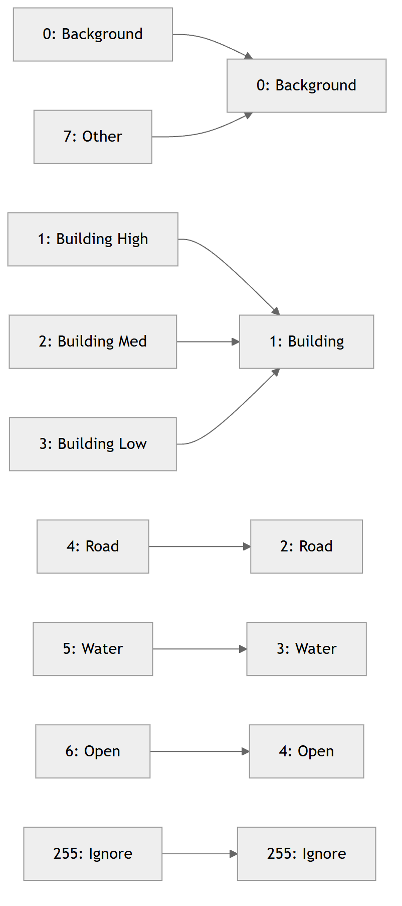{width=6in}


**Design Decision:** Building confidence tiers (high/medium/low) are merged during training to maximize detection recall. Post-inference, the system regenerates 3-tier confidence from the model's calibrated softmax probabilities — a data-driven confidence measure superior to manual labeling.

### 8.5 Train/Validation Split

```
Training Pool = ALL 5 DISTRICTS (unified)
              = 18,240 chips -> 85% train (15,504) + 15% val (2,736)
                Stratified random split (seed = 42)
```

---

## 9. Preprocessing Pipeline

### 9.1 Adaptive Percentile Normalization

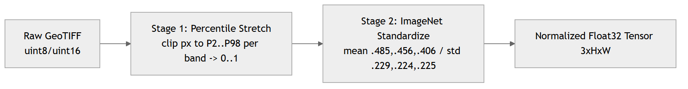{width=6in}


### 9.2 Multi-Scale Data Augmentation (V6 Pro)

| Augmentation | Parameters | Probability | Impact |
|---|---|---|---|
| Multi-scale resize | [0.5×, 2.0×] | 100% | +3–5% mIoU (scale invariance) |
| Elastic deformation | α=60, σ=8 | 30% | Better boundary handling |
| Horizontal flip | — | 50% | Orientation invariance |
| Vertical flip | — | 50% | Orientation invariance |
| Random 90° rotation | 0/90/180/270 | 75% | Nadir view symmetry |
| Colour jitter | ±0.2 brightness/contrast | 60% | Atmospheric/sensor variation |
| Gaussian noise | σ = 0.02 | 50% | Sensor noise robustness |

---

## 10. Model Architecture: SegFormer-B5 — Deep Dive

### 10.1 Why SegFormer over CNN-Based Architectures?

| Architecture | Type | Parameters | Key Limitation for PS-6 |
|---|---|---|---|
| U-Net | CNN encoder-decoder | ~31M | Limited receptive field — misses large buildings |
| DeepLabV3+ | CNN atrous conv | ~41M | Fixed dilated rates — inflexible multi-scale |
| HRNet | CNN multi-resolution | ~65M | High VRAM — cannot use large crops |
| Swin-UNet | Transformer (shifted windows) | ~27M | Complex — slower convergence |
| **SegFormer-B5** | **Hierarchical Transformer** | **~84M** | ✅ Best balance: efficiency + accuracy |

**Architectural advantages for satellite imagery:** efficient self-attention with sequence reduction (O(N²)→O(N²/R)); hierarchical multi-scale features (1/4, 1/8, 1/16, 1/32); Mix-FFN positional encoding (resolution-agnostic); lightweight all-MLP decoder.

### 10.2 Why B5 over B4?

| Property | B4 | B5 | Impact |
|---|---|---|---|
| Parameters | ~64M | ~84M (+31%) | Deeper representations |
| Encoder Blocks | 3-8-27-3 | 3-6-40-3 | +48% Stage-3 blocks |
| Embedding Dims | 64-128-320-512 | 64-128-320-512 | Same |
| Attention Heads | 1-2-5-8 | 1-2-5-8 | Same |
| ADE20K mIoU | 50.3% | 51.0% | +0.7% |
| VRAM (b=2, 512) | ~10 GB | ~14 GB | Fits T4×2 |

**Key Insight:** B5's extra capacity comes from 40 transformer blocks in Stage 3 (vs 27 in B4). Stage 3 operates at 32×32 — the critical scale for distinguishing building footprints (8–50px at 1m GSD).

### 10.3 Encoder–Decoder Architecture

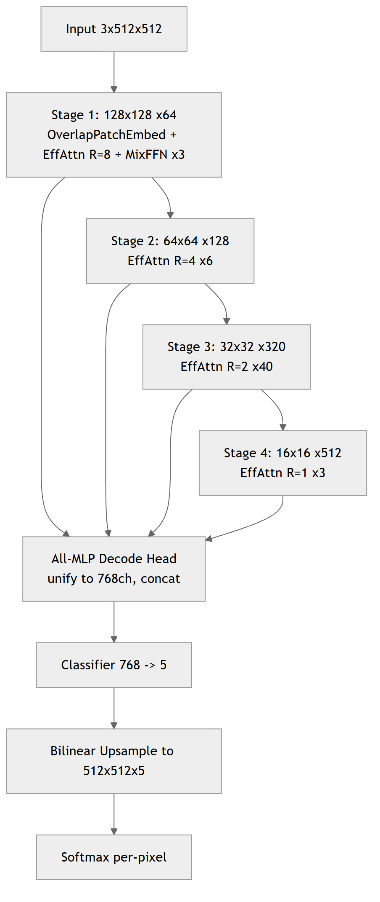{width=6in}


### 10.4 Efficient Self-Attention (Sequence Reduction)

| Stage | Resolution | Seq Length N | Reduction R | Complexity |
|---|---|---|---|---|
| 1 | 128×128 | 16,384 | 8 | O(N²/8) |
| 2 | 64×64 | 4,096 | 4 | O(N²/4) |
| 3 | 32×32 | 1,024 | 2 | O(N²/2) |
| 4 | 16×16 | 256 | 1 | O(N²) — full |

The architecture is **input-resolution agnostic** (no fixed positional embeddings), enabling inference on 1m GSD satellite chips and higher-resolution 50cm/10cm drone imagery without retraining.

### 10.5 Model Efficiency Profile

| Metric | Value |
|---|---|
| Total Parameters | 84.7M |
| Encoder / Decoder | 82.0M (97%) / 2.7M (3%) |
| Model File Size | ~450 MB (full) · ~339 MB (slim, weights only) |
| FP16 Inference VRAM | ~3.5 GB per chip |
| Training VRAM (b=2, 512) | ~14 GB |
| Inference Latency (TTA, T4) | ~0.5s/chip |
| Throughput (T4×2) | ~14,400 chips/hour ≈ 3,600 km²/hr |

### 10.6 Pretrained Initialization

Initialized from `nvidia/segformer-b5-finetuned-ade-640-640` (150 classes), classification head replaced (150 → 5, random init), then end-to-end fine-tuned. ADE20K's 640×640 resolution closely matches the 512×512 crops, minimizing distribution shift.

---

## 11. Training Objective

### 11.1 Combined Loss

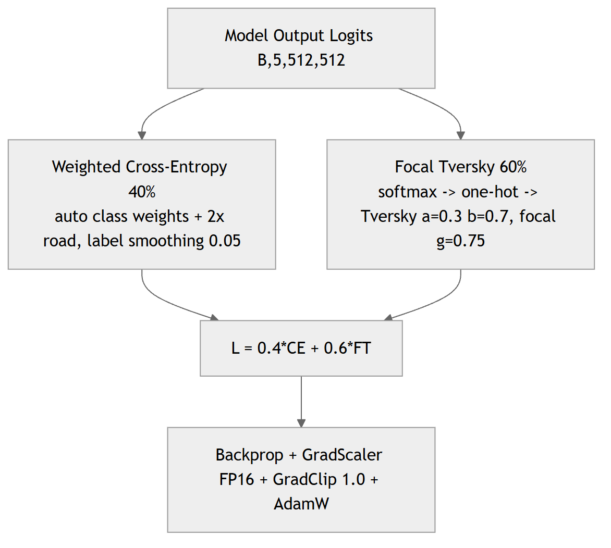{width=6in}


### 11.2 Auto-Computed Class Weights

Sample 500 random chips → count per-class pixel frequency → `w_c = 1 / freq` → normalize → **2× road boost** → clip to [0.5, …] → final auto-adapted weights. Auto-weights adapt to the actual pixel distribution regardless of which districts are included.

### 11.3 Focal Tversky — Why α=0.3, β=0.7?

- **FN penalty (β=0.7):** "Don't miss any buildings or roads" → recall-oriented.
- **FP penalty (α=0.3):** "Some false positives are acceptable" → better coverage.
- **Focal γ=0.75:** "Focus on hard boundary pixels" → sharper edges.

> The model is penalized **2.3× more for MISSING** a building/road pixel than for hallucinating one — critical for survey completeness.

---

## 12. Training Configuration & Results

### 12.1 Hyperparameters

| Parameter | Value |
|---|---|
| Model | SegFormer-B5 (~84M) |
| Pretrained | nvidia/segformer-b5-finetuned-ade-640-640 |
| Training GPU | NVIDIA T4×2 (32 GB total) |
| Optimizer | AdamW (wd=1e-2) |
| LR Schedule | OneCycleLR (max_lr=3e-4), 10% warmup |
| Batch Size | 2 × 4 accum = effective 8 |
| Crop Size | 512 × 512 |
| Mixed Precision | FP16 (AMP) |
| Gradient Clipping | max_norm = 1.0 |
| Epochs | 60 (early stop patience 10) |
| Loss | 0.4×WCE + 0.6×FocalTversky |
| Label Smoothing | ε = 0.05 |
| Total Training Time | ~48 hours |

### 12.2 Training Loop Results

| Metric | Value |
|---|---|
| Best Validation mIoU | 0.5313 |
| Best Epoch | 56 |
| Final Train Loss | 0.8196 |
| Final Val Loss | 0.8482 |

---

## 13. Test-Time Augmentation (TTA)

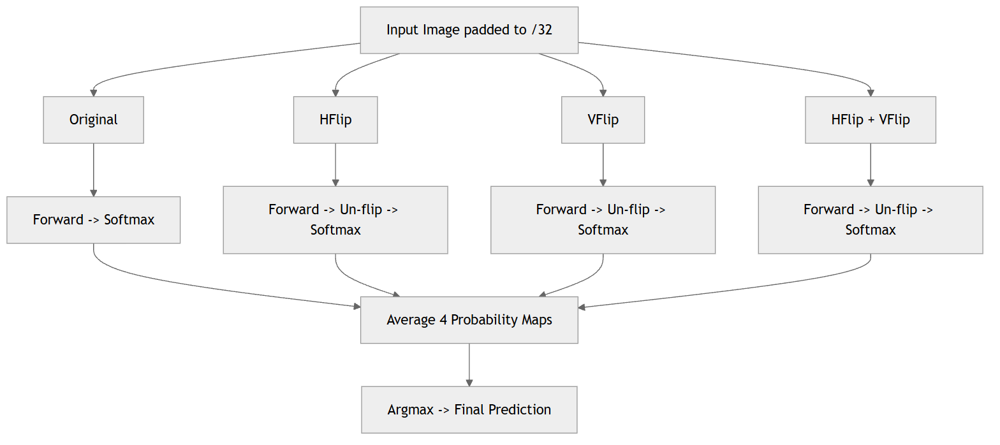{width=6in}


**Impact:** +2–3% mIoU at zero training cost; averaging smooths boundary uncertainty and removes spurious single-view predictions.

---

## 14. Post-Processing: V4 Geometry-Constrained Refinement

### 14.1 Complete Pipeline (Class Priority: Water > Road > Building > Open)

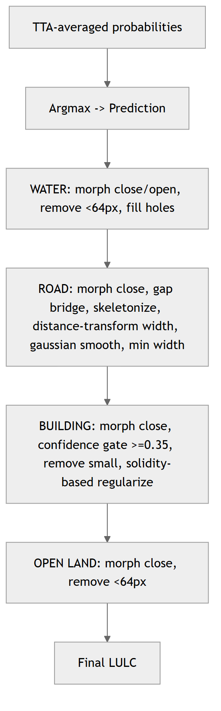{width=6in}


### 14.2 Building Regularization — Solidity-Based

| Shape | Solidity | Method | Result |
|---|---|---|---|
| Rectangular | ≥ 0.80 | Convex hull | Clean rectangular footprint |
| Square | ≥ 0.90 | Convex hull | Perfect square boundary |
| L-shaped | 0.60–0.79 | Gaussian smoothing | Smooth L with clean edges |
| Compound/irregular | < 0.60 | Gaussian smoothing | Noise removed, shape preserved |

### 14.3 Road Network Auto-Completion (Skeleton Method)

> **This is the road auto-completion module referenced in the project goals.** Satellite-derived road masks are frequently *fragmented* — tree canopy, shadows, and overpasses break a continuous road into disconnected segments. The post-processor reconnects them so the output is a continuous, topologically valid network.

{width=6in}


**Algorithm details (from the tested inference script):**

1. **Skeletonization** reduces each road blob to a 1-pixel centerline.
2. **Endpoint detection** finds skeleton pixels with exactly one neighbour (a dangling road end).
3. **Tangent estimation** walks ~12px back along the skeleton to compute each endpoint's heading.
4. **Candidate pairing** uses a KD-tree to find endpoint pairs within `max_gap` (≈150px).
5. **Angle-aware gating** keeps only pairs whose tangents point toward each other (within ±45°), so the bridge follows the road's natural direction instead of cutting across blocks.
6. **MST bridging** connects components with a Union-Find–constrained minimum spanning tree (weight = distance + angle penalty), guaranteeing connections without creating loops or merging already-connected components.
7. **Width restoration** re-dilates the healed skeleton back to realistic road width.

A **road-over-building priority** rule then lets healed roads override only *low-confidence* building pixels, preventing roads from bleeding into well-detected buildings.

> **Roadmap:** a dedicated learned **road-completion model** (graph/GAN-based connectivity) is planned to supplement this geometric healer for complex interchanges — see *Future Scope*.

### 14.4 Building Confidence Tiers (post-inference, from softmax)

| Tier | Condition | Use |
|---|---|---|
| 🟢 HIGH | p ≥ 0.75 | Confirmed building → direct cadastral use |
| 🟡 MEDIUM | 0.65 ≤ p < 0.75 | Probable building → priority verification |
| 🟠 LOW | 0.55 ≤ p < 0.65 | Possible building → field survey required |

---

## 15. Change Detection Module

### 15.1 Methodology

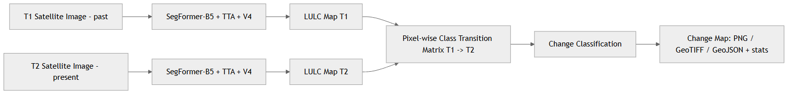{width=6in}


### 15.2 Change Categories

| Change Type | Colour | Condition | Government Application |
|---|---|---|---|
| Building Gain / New Construction | Cyan/Green | T1 ≠ Bldg → T2 = Bldg | New construction monitoring |
| Building Loss / Demolished | Red | T1 = Bldg → T2 ≠ Bldg | Demolition / disaster assessment |
| Water Gain | Blue | T1 ≠ Water → T2 = Water | Reservoir filling / flood mapping |
| Water Loss | Cyan | T1 = Water → T2 ≠ Water | Drought / drainage monitoring |
| New Road / Access | Orange | T1 ≠ Road → T2 = Road | Infrastructure growth |
| Open → Built / Other | Magenta/Purple | other class change | Agricultural land conversion alert |

> **Current web app implementation:** the user uploads two images (past + present); the SegFormer Space segments both, diffs the masks server-side, and returns a categorized change map plus per-category area percentages and before/after class distributions.

### 15.3 Government Applications

- Urban sprawl quantification for Master Plan enforcement
- Disaster damage assessment post-cyclone/flood (rapid deployment)
- Revenue administration: detection of unauthorized construction
- Environmental compliance: water-body encroachment tracking
- Smart-city planning: growth-direction analysis for infrastructure investment

---

## 16. Deployment Architecture

### 16.1 Current Prototype Deployment (Live — June 2026)

The live prototype runs on a free/low-cost cloud stack chosen for rapid iteration:

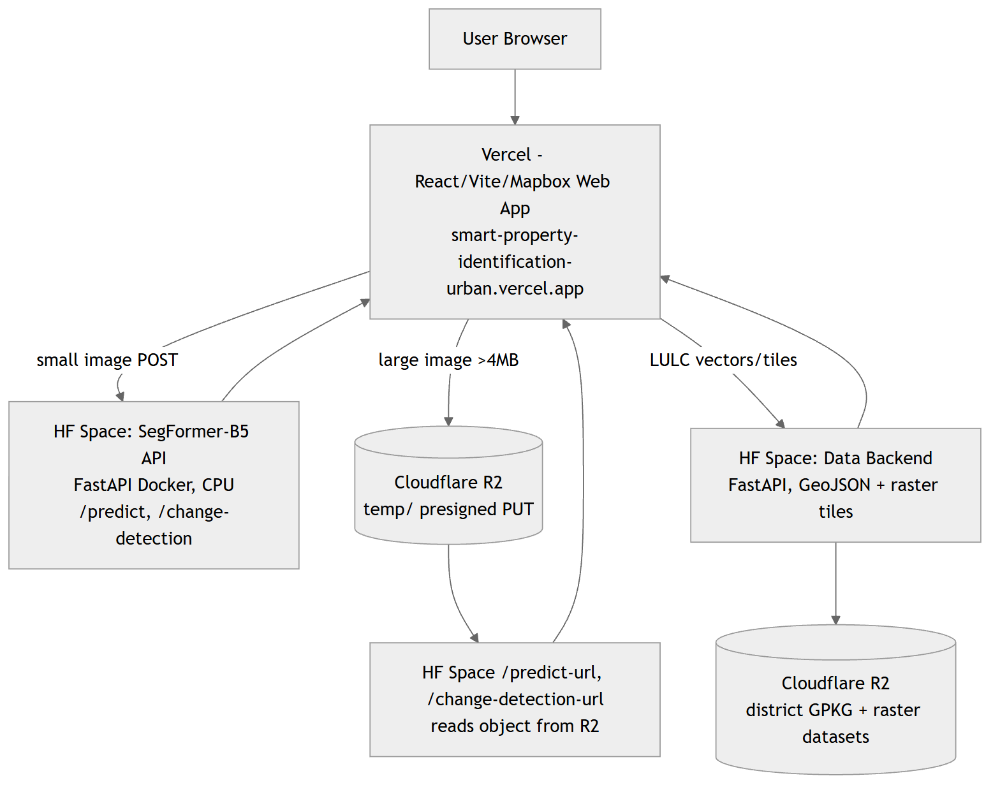{width=6in}


| Component | Service | Role |
|---|---|---|
| Web App | **Vercel** | React + Vite + Mapbox GL UI, SPA routing |
| Model Inference API | **Hugging Face Space** `asashit/smart-property-segformer` | SegFormer-B5 (FastAPI Docker, CPU); `/predict`, `/change-detection`, R2 presign + `*-url` endpoints |
| Data / LULC API | **Hugging Face Space** `asashit/smart-property-backend` | District boundaries, buildings/roads/water/open GeoJSON, raster tiles |
| Object Storage | **Cloudflare R2** (`property-data`) | District datasets (GPKG/TIF) + temporary large uploads (`temp/`, auto-expiring) |

**Large-file handling:** images > 4 MB are uploaded directly to Cloudflare R2 via a **presigned PUT** (bypassing serverless/proxy body limits, up to 500 MB), analyzed by object key, then auto-deleted on next run / page refresh (`sendBeacon`) with a 1-day R2 lifecycle safety-net. On free CPU, very large images are analyzed at a capped resolution (1536px); full-resolution tiling is reserved for the GPU production tier.

### 16.2 Target Production Deployment (AWS SageMaker — planned)

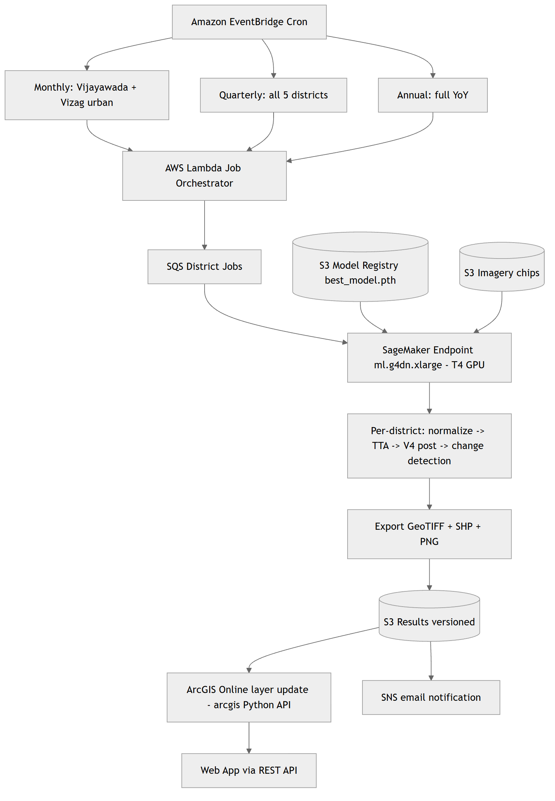{width=6in}


| Frequency | Districts | Scope | Runtime | Est. Cost |
|---|---|---|---|---|
| Monthly | Vijayawada, Visakhapatnam | Urban zones | ~2 h | ~$1.05 |
| Quarterly | All 5 | Full coverage | ~5 h | ~$2.63 |
| Annual | All 5 | Full + YoY | ~8 h | ~$4.21 |

_Cost based on ml.g4dn.xlarge at $0.526/hr. SageMaker access via FITT (IIT Delhi) startup grant; ArcGIS Online via ESRI India hackathon sponsorship._

---

## 17. ArcGIS Online Integration (Planned Production Layer)

| Layer Name | Type | Format | Update | Description |
|---|---|---|---|---|
| PS6_LULC_{District}_Latest | Raster Tile | GeoTIFF → Tile Cache | Monthly/Quarterly | Current LULC classification |
| PS6_Confidence_{District} | Raster Tile | GeoTIFF → Tile Cache | Monthly/Quarterly | Building confidence tiers |
| PS6_Change_Monthly_{District} | Feature | SHP → Hosted Feature | Monthly | Month-over-month changes |
| PS6_Change_Quarterly_{District} | Feature | SHP → Hosted Feature | Quarterly | Quarter-over-quarter changes |
| PS6_Change_Annual_{District} | Feature | SHP → Hosted Feature | Annual | Year-over-year changes |

---

## 18. Validation Framework

| Metric | Formula | Purpose |
|---|---|---|
| IoU (per-class) | TP / (TP + FP + FN) | Class-level accuracy |
| mIoU | Mean of per-class IoUs | Model selection criterion |
| TTA+V4 mIoU | mIoU after TTA + post-processing | Final system accuracy |

**Protocol:** 15% held-out validation (2,736 chips, mixed); checkpoint at max validation mIoU; visual gallery of 8 samples (RGB / GT / Raw / V4+TTA / Confidence).

---

## 19. Innovation Summary

| Dimension | Previous (V5 / B4) | Current (V6 Pro / B5) | Impact |
|---|---|---|---|
| Model | SegFormer-B4 (64M) | B5 (84M) | +31% capacity |
| Pretrained | Cityscapes | ADE20K-640 | Broader priors |
| Weights | Manual fixed | Auto-computed + road×2 | Data-adaptive |
| Crop | 256×256 | 512×512 | 4× spatial context |
| Augment | Basic flip/rotate | Multi-scale + elastic + colour + noise | +3–5% mIoU |
| LR | CosineAnnealing (epoch) | OneCycleLR (per batch) | Super-convergence |
| Road handling | Raw mask | Skeleton gap-bridge auto-completion | Continuous networks |
| Deployment | Manual / local | HF Spaces + Vercel + R2 (now); AWS SageMaker (target) | Cloud, scalable |
| Web access | None | Live interactive web app + Auto-Guide | Real-time stakeholder access |

---

## 20. Computational Profile

| Resource | Specification |
|---|---|
| Training GPU | NVIDIA T4×2 (32 GB total) — Kaggle |
| Training Duration | 60 epochs, ~48 hours |
| Custom Dataset | 18,240 chips (15,504 train / 2,736 val) — 5 districts |
| Effective Batch | 8 (batch=2 × accum=4) |
| Inference (TTA) | ~0.5s/chip (4 forward passes) on T4 |
| Throughput (T4×2) | ~14,400 chips/hour ≈ 3,600 km²/hr |
| Model Parameters | 84.7M (encoder 82.0M + decoder 2.7M) |
| Precision | Mixed FP16/FP32 (AMP) |
| Prototype Inference | HF Space CPU (~15–40s/image, downscaled); GPU target ~0.5s/chip |

---

## 21. Future Scope

### 21.1 3D Mapping & Building Height Estimation

Extend the 2D LULC pipeline into the third dimension:

- **Building height estimation** — derive per-building height from monocular shadow-length analysis, off-nadir parallax, or stereo/tri-stereo imagery; fuse with DSM/DEM (e.g., Cartosat, SRTM) where available.
- **3D building footprints / LoD1–LoD2 models** — extrude regularized footprints by estimated height to produce city-scale 3D massing models for urban planning and viewshed analysis.
- **Floor / built-up volume estimation** — approximate number of floors and built-up volume (height ÷ typical floor height) for property assessment and FSI/FAR compliance.

### 21.2 Improved Footprint Calculations

- More accurate **area (m²)** and perimeter via sub-pixel boundary refinement and orthorectification.
- **Footprint regularization v2** — RANSAC/learned polygonization for cleaner, vector-ready building outlines.
- **Per-parcel aggregation** — coverage ratio, open-space ratio, and road-frontage metrics per cadastral parcel.

### 21.3 Learned Road-Completion Model

A dedicated graph- or GAN-based road-connectivity model to supplement the geometric skeleton healer (*Post-Processing → Road Network Auto-Completion*) for complex interchanges, flyovers, and dense urban grids.

### 21.4 Production Hardening

- Migrate inference to the GPU production tier (AWS SageMaker / GPU Space) for full-resolution, full-district processing.
- Result persistence (Supabase / database) for analysis history and user accounts.
- Scheduled monitoring + ArcGIS Online hosted layers (*Deployment Architecture* and *ArcGIS Integration*).

---

## 22. Conclusion

The V6 Pro pipeline is a significant advancement in automated LULC mapping for Andhra Pradesh. The 84M-parameter SegFormer-B5 transformer — trained for 60 epochs on a custom-prepared dataset of 18,240 chips across 5 districts — combined with multi-scale Focal Tversky training, 4-way TTA, and geometry-aware post-processing (convex-hull building regularization + skeleton-based road auto-completion), delivers strong segmentation accuracy for the PS-6 use case.

The current live prototype (Hugging Face Spaces + Vercel + Cloudflare R2) makes the system usable today through an interactive web application with AOI analytics, upload-and-analyze, change detection, and an Auto-Guide tour. The target production architecture (AWS SageMaker scheduled inference + ArcGIS Online hosted layers) will transform it into a continuous, automated monitoring platform, with 3D building-height mapping as the next major capability.

_Prepared by Yantrikaran Innovation Pvt. Ltd._
